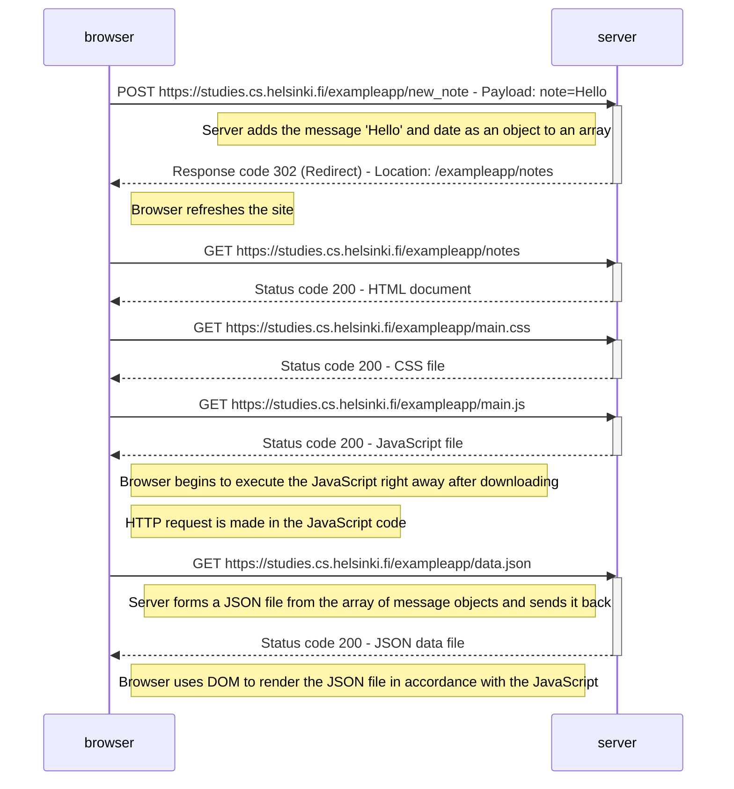

```mermaid
sequenceDiagram
    participant browser
    participant server

    browser->>server: POST https://studies.cs.helsinki.fi/exampleapp/new_note - Payload: note=Hello
    activate server
    Note left of server: Server adds the message 'Hello' and date as an object to an array
    server-->>browser: Response code 302 (Redirect) - Location: /exampleapp/notes
    deactivate server

    Note right of browser: Browser refreshes the site
    browser->>server: GET https://studies.cs.helsinki.fi/exampleapp/notes
    activate server
    server-->>browser: Status code 200 - HTML document
    deactivate server

    browser->>server: GET https://studies.cs.helsinki.fi/exampleapp/main.css
    activate server
    server-->>browser: Status code 200 - CSS file
    deactivate server

    browser->>server: GET https://studies.cs.helsinki.fi/exampleapp/main.js
    activate server
    server-->>browser: Status code 200 - JavaScript file
    deactivate server
    Note right of browser: Browser begins to execute the JavaScript right away after downloading

    Note right of browser: HTTP request is made in the JavaScript code
    browser->>server: GET https://studies.cs.helsinki.fi/exampleapp/data.json
    activate server
    Note left of server: Server forms a JSON file from the array of message objects and sends it back
    server-->>browser: Status code 200 - JSON data file
    deactivate server
    Note right of browser: Browser uses DOM to render the JSON file in accordance with the JavaScript
```