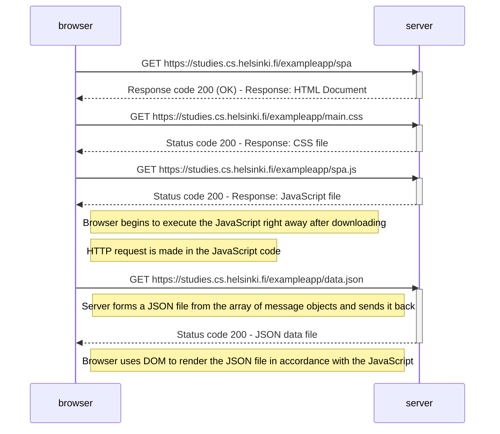

```mermaid
sequenceDiagram
    participant browser
    participant server

    browser->>server: GET https://studies.cs.helsinki.fi/exampleapp/spa
    activate server
    server-->>browser: Response code 200 (OK) - Response: HTML Document
    deactivate server


    browser->>server: GET https://studies.cs.helsinki.fi/exampleapp/main.css
    activate server
    server-->>browser: Status code 200 - Response: CSS file
    deactivate server

    browser->>server: GET https://studies.cs.helsinki.fi/exampleapp/spa.js
    activate server
    server-->>browser: Status code 200 - Response: JavaScript file
    deactivate server
    Note right of browser: Browser begins to execute the JavaScript right away after downloading

    Note right of browser: HTTP request is made in the JavaScript code
    browser->>server: GET https://studies.cs.helsinki.fi/exampleapp/data.json
    activate server
    Note left of server: Server forms a JSON file from the array of message objects and sends it back
    server-->>browser: Status code 200 - JSON data file
    deactivate server
    Note right of browser: Browser uses DOM to render the JSON file in accordance with the JavaScript
```