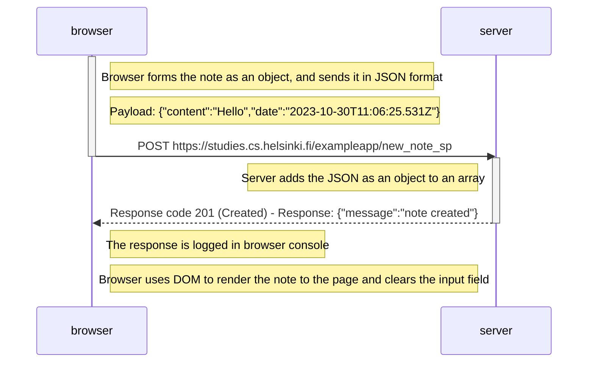

```mermaid
sequenceDiagram
    participant browser
    participant server
    
    activate browser
    Note right of browser: Browser forms the note as an object, and sends it in JSON format
    Note right of browser: Payload: {"content":"Hello","date":"2023-10-30T11:06:25.531Z"}
    browser->>server: POST https://studies.cs.helsinki.fi/exampleapp/new_note_sp
    deactivate browser
    activate server
    Note left of server: Server adds the JSON as an object to an array
    server-->>browser: Response code 201 (Created) - Response: {"message":"note created"}
    deactivate server

    Note right of browser: The response is logged in browser console
    Note right of browser: Browser uses DOM to render the note to the page and clears the input field    
```